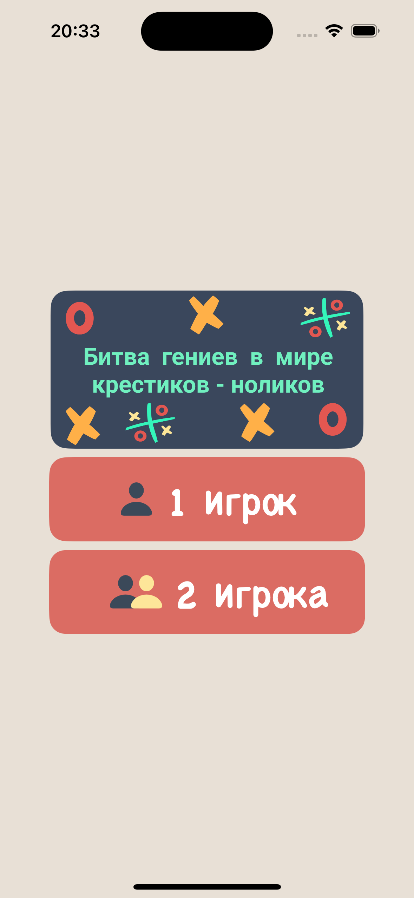
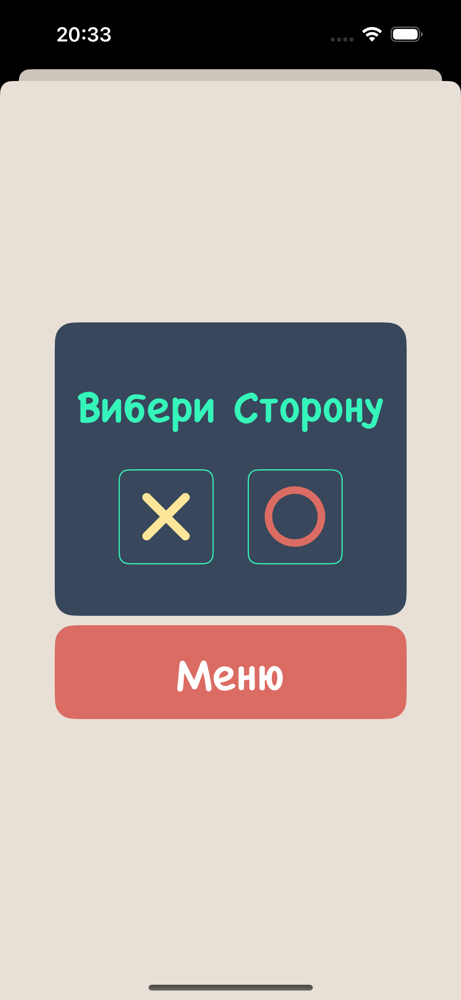
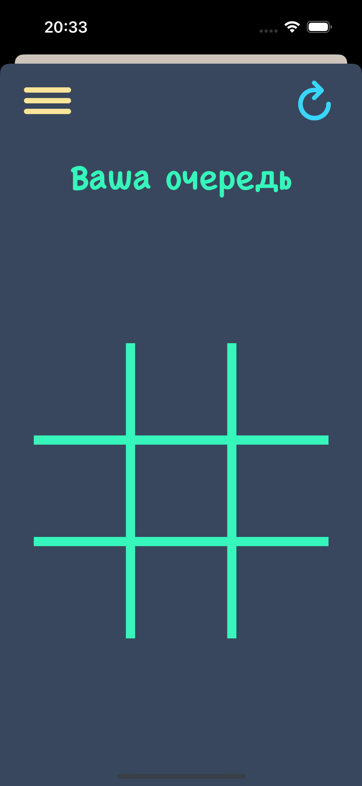
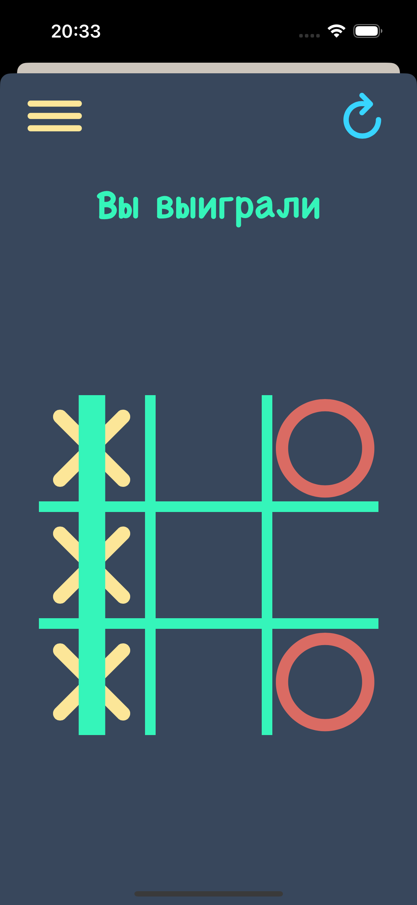
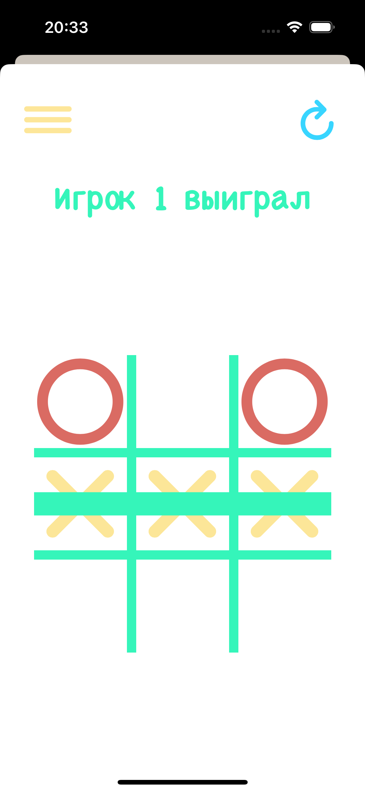
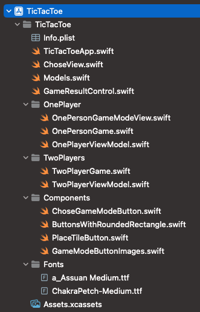

# Крестики-нолики

 

Это приложение для игры в крестики-нолики, которое предлагает два режима игры: для одного игрока и для двух игроков.

## Возможности

1. **Режим для одного игрока**: Игрок соревнуется с мини-искусственным интеллектом.
2. **Режим для двух игроков**: Две стороны могут играть друг против друга.

## Архитектура

Приложение использует архитектуру MVVM (Model-View-ViewModel) из-за простоты интерфейса. Также в проекте используются протоколы и расширения (extensions).

## Технологии

- Swift
- SwiftUI
- MVVM архитектура

## Установка

1. Клонируйте репозиторий: `[git clone https://github.com/username/tictactoe.git](https://github.com/islombeck-g/TicTacToe.git)`
2. Откройте проект в Xcode.
3. Соберите и запустите приложение на симуляторе или физическом устройстве.

## Использование

1. При запуске приложения вы увидите главное меню с двумя вариантами игры.
2. Выберите режим для одного игрока или для двух игроков.
3. Следуйте инструкциям на экране, чтобы играть в крестики-нолики.

## Выбор режима игры

 

## Режим для одного игрока

 
 
  

## Режим для двух игроков

 

## Структура проекта

 

## Автор

- [Исломбек]
